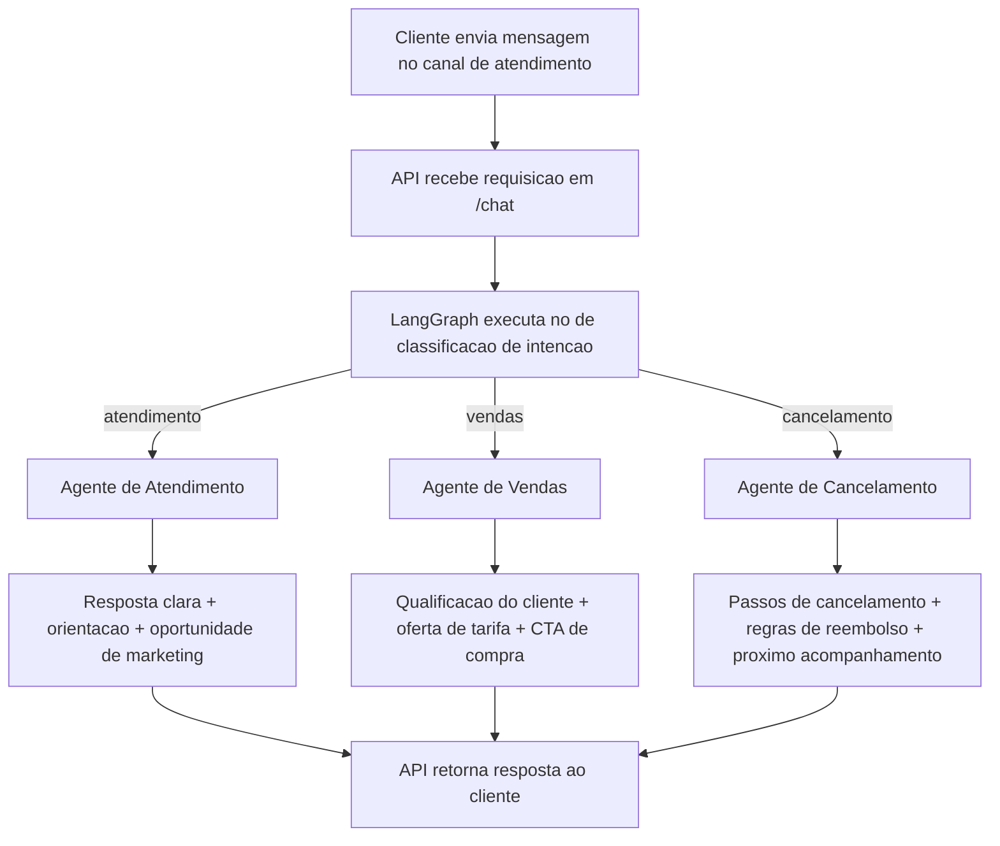

# Aplicacao de Vendas de Passagens Aereas e Marketing

Projeto com 3 agentes orquestrados por LangGraph usando DeepSeek via LangChain:

- Agente de atendimento
- Agente de vendas
- Agente de cancelamento

## Fluxo de negocio



## Arquitetura

1. O endpoint `/chat` recebe a mensagem do cliente.
2. Um no de classificacao identifica a intencao (`atendimento`, `vendas`, `cancelamento`).
3. O fluxo do LangGraph roteia para o agente especializado.
4. O agente responde em portugues brasileiro.

## Como a aplicacao funciona

1. Entrada do cliente:
  a API recebe JSON com `message`, e opcionalmente `customer_name` e `reservation_code`.

2. Classificacao de intencao:
  o LangGraph chama um classificador LLM que retorna exatamente uma intencao entre:
  - `atendimento`
  - `vendas`
  - `cancelamento`

3. Roteamento inteligente:
  com base na intencao, o grafo envia a conversa para o agente especialista.

4. Resposta do agente:
  - Atendimento: resolve duvidas gerais e inclui oportunidades leves de marketing.
  - Vendas: coleta dados faltantes, sugere tarifas e conduz para fechamento.
  - Cancelamento: orienta cancelamento com empatia, incluindo estorno e regras de tarifa.

5. Retorno ao cliente:
  a API responde com:
  - `intent`: intencao identificada
  - `response`: texto final gerado pelo agente correspondente

## Fluxo tecnico (componentes)

- `main.py`: expoe endpoints `/health` e `/chat`.
- `app/graph.py`: define o grafo de estados e as rotas entre os nos.
- `app/agents.py`: encapsula o cliente DeepSeek e os prompts dos tres agentes.
- `app/models.py`: define os modelos de entrada/saida com validacao via Pydantic.

## Requisitos

- Python 3.11+
- Chave da API DeepSeek

## Como executar

1. Crie e ative um ambiente virtual:

```bash
python3 -m venv .venv
source .venv/bin/activate
```

2. Instale as dependencias:

```bash
pip install -r requirements.txt
```

3. Configure variaveis de ambiente:

```bash
cp .env.example .env
```

Edite o arquivo `.env` e preencha `DEEPSEEK_API_KEY`.

4. Inicie a API:

```bash
uvicorn main:app --reload --port 8000
```

## Teste rapido

```bash
curl -X POST http://127.0.0.1:8000/chat \
  -H "Content-Type: application/json" \
  -d '{
    "message": "Quero uma passagem de Sao Paulo para Lisboa em setembro",
    "customer_name": "Carla"
  }'
```

Exemplo para cancelamento:

```bash
curl -X POST http://127.0.0.1:8000/chat \
  -H "Content-Type: application/json" \
  -d '{
    "message": "Quero cancelar minha viagem",
    "customer_name": "Marcos",
    "reservation_code": "ABC123"
  }'
```

## Simulacao de fluxos dos 3 agentes

Para simular varias situacoes e observar diferentes fluxos de execucao (atendimento, vendas e cancelamento), execute:

```bash
python -m scripts.simular_fluxos
```

O simulador roda multiplos cenarios e mostra:

- entrada do cliente
- fluxo identificado pelo grafo
- resumo da resposta
- contagem final por tipo de fluxo

## Tela React para simular todos os cenarios

Com a API em execucao, abra no navegador:

```text
http://127.0.0.1:8000/simulador
```

Nesta tela voce pode:

- executar todos os cenarios de uma vez
- executar cenarios individualmente
- visualizar o `intent` identificado e a resposta completa
- acompanhar o resumo com contagem por fluxo

## Observacoes

- O classificador de intencao e baseado em LLM.
- As respostas sao geradas em tempo real pelo modelo DeepSeek.
- Para producao, adicione autenticacao, logs estruturados e persistencia de conversas.
- O diagrama Mermaid pode ser visualizado diretamente em plataformas que suportam Mermaid (como GitHub e VS Code com extensoes).
