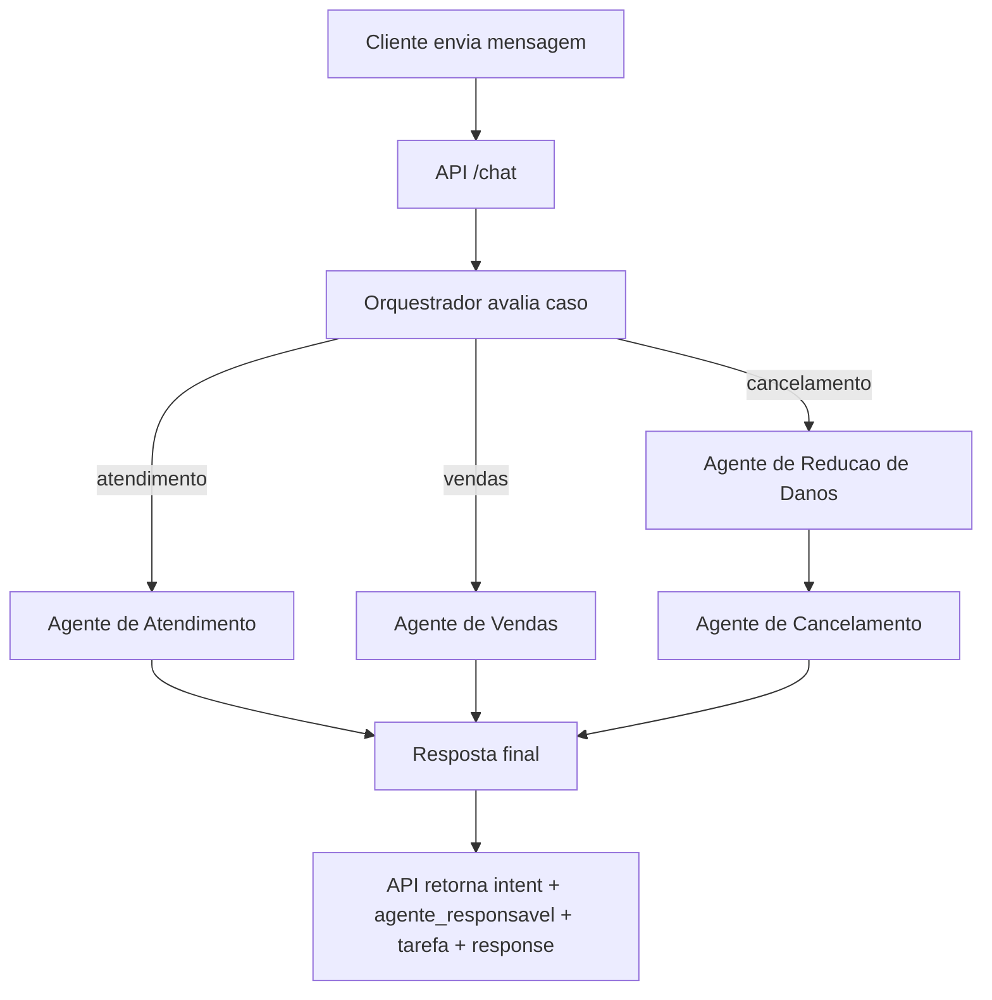
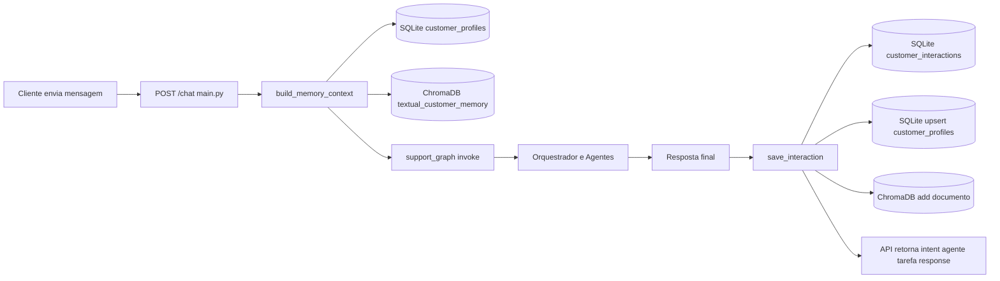

# Aplicacao de Vendas de Passagens Aereas e Marketing

Projeto com 3 agentes orquestrados por LangGraph usando DeepSeek via LangChain:

- Agente de atendimento
- Agente de vendas
- Agente de cancelamento

## Fluxo de negocio



## Arquitetura

1. O endpoint `/chat` recebe a mensagem do cliente.
2. O no `orquestrador` analisa o caso e decide o agente responsavel e a tarefa.
3. O fluxo do LangGraph roteia para `atendimento`, `vendas` ou `reducao_danos`.
4. Em casos de cancelamento, a `reducao_danos` roda antes do agente de `cancelamento`.
5. A API retorna metadados de orquestracao e a resposta final.

## Como a aplicacao funciona

1. Entrada do cliente:
  a API recebe JSON com `message`, e opcionalmente `customer_name` e `reservation_code`.

2. Orquestracao do caso:
  o LangGraph chama o orquestrador LLM que define:
  - `atendimento`
  - `vendas`
  - `cancelamento`
  alem de `agente_responsavel` e `tarefa`.

3. Roteamento inteligente:
  com base na intencao, o grafo envia a conversa para o agente especialista.
  se for cancelamento, obrigatoriamente executa `reducao_danos` antes de `cancelamento`.

4. Resposta do agente:
  - Atendimento: resolve duvidas gerais e inclui oportunidades leves de marketing.
  - Vendas: coleta dados faltantes, sugere tarifas e conduz para fechamento.
  - Reducao de danos: tenta reter o cliente com alternativas seguras.
  - Cancelamento: conclui os passos formais de cancelamento quando necessario.

5. Retorno ao cliente:
  a API responde com:
  - `intent`: intencao identificada
  - `agente_responsavel`: agente definido pelo orquestrador
  - `tarefa`: objetivo principal do atendimento
  - `response`: texto final gerado pelo agente correspondente

## Fluxo tecnico (componentes)

- `main.py`: expoe endpoints `/health` e `/chat`.
- `app/graph.py`: define o grafo de estados e as rotas entre os nos.
- `app/agents/`: classes dos agentes e utilitarios compartilhados.
- `app/agents/flight_info_agent.py`: agente de voos com tools para busca em base SQLite.
- `app/models.py`: define os modelos de entrada/saida com validacao via Pydantic.

## Memoria (ChromaDB + SQLite)

O projeto usa duas memorias complementares:

- Memoria textual: armazenada no ChromaDB (`data/chroma_memory`), com historico textual de interacoes.
- Memoria estruturada do cliente: extraida/validada por Pydantic e persistida no SQLite (`data/customer_memory.db`).

Chamadas no fluxo do endpoint `/chat`:



Diagrama textual (fallback quando Mermaid nao renderiza):

```text
Cliente -> /chat (main.py)
  -> build_memory_context(customer_name)
     -> SQLite: customer_profiles
     -> ChromaDB: textual_customer_memory
  -> support_graph.invoke(memory_context + message)
  -> resposta final
  -> save_interaction(record)
     -> SQLite: customer_interactions
     -> SQLite: upsert customer_profiles (Pydantic)
     -> ChromaDB: add documento textual
  -> retorno da API
```

Resumo do ponto de integracao:

1. Antes do grafo: `main.py` chama `build_memory_context` para recuperar contexto do cliente.
2. Depois da resposta: `main.py` chama `save_interaction` para gravar memoria textual (ChromaDB) e memoria estruturada (SQLite + Pydantic).
3. Durante o atendimento: `app/graph.py` injeta `memory_context` na mensagem enviada aos agentes.

## Base de dados de voos (SQLite)

- Banco: `data/flights.db`
- Tabela principal: `flights`
- Janela de dados: voos gerados para os proximos 60 dias (aproximadamente dois meses)
- Conteudo: origem, destino, horarios, companhia, classe, preco, assentos e status

O banco e criado/populado automaticamente pelo `FlightInfoAgent` quando ainda nao existe.

### Agent de voos para outros agentes

O `FlightInfoAgent` fornece informacoes de voos para os demais agentes por meio das tools:

- `buscar_voos`: busca por origem/destino e opcionalmente por data
- `melhores_ofertas_voos`: lista ofertas mais baratas

Atualmente, o agente de vendas usa essas tools para montar cotacoes reais com base no SQLite.

## Requisitos

- Python 3.11+
- Chave da API DeepSeek

## Como executar

1. Crie e ative um ambiente virtual:

```bash
python3 -m venv .venv
source .venv/bin/activate
```

2. Instale as dependencias:

```bash
pip install -r requirements.txt
```

3. Configure variaveis de ambiente:

```bash
cp .env.example .env
```

Edite o arquivo `.env` e preencha `DEEPSEEK_API_KEY`.

4. Inicie a API:

```bash
uvicorn main:app --reload --port 8000
```

## Teste rapido

```bash
curl -X POST http://127.0.0.1:8000/chat \
  -H "Content-Type: application/json" \
  -d '{
    "message": "Quero uma passagem de Sao Paulo para Lisboa em setembro",
    "customer_name": "Carla"
  }'
```

Exemplo para cancelamento:

```bash
curl -X POST http://127.0.0.1:8000/chat \
  -H "Content-Type: application/json" \
  -d '{
    "message": "Quero cancelar minha viagem",
    "customer_name": "Marcos",
    "reservation_code": "ABC123"
  }'
```

## Simulacao de fluxos dos 3 agentes

Para simular varias situacoes e observar diferentes fluxos de execucao (atendimento, vendas e cancelamento), execute:

```bash
python -m scripts.simular_fluxos
```

O simulador roda multiplos cenarios e mostra:

- entrada do cliente
- fluxo identificado pelo grafo
- resumo da resposta
- contagem final por tipo de fluxo

## Tela React para simular todos os cenarios

Com a API em execucao, abra no navegador:

```text
http://127.0.0.1:8000/simulador
```

Nesta tela voce pode:

- executar todos os cenarios de uma vez
- executar cenarios individualmente
- visualizar o `intent` identificado e a resposta completa
- acompanhar o resumo com contagem por fluxo

## Interface grafica de chat

Com a API em execucao, abra no navegador:

```text
http://127.0.0.1:8000/chat-ui
```

Nesta tela voce pode:

- conversar livremente com o sistema
- ver qual agente respondeu cada mensagem (`agente_responsavel`)
- ver `intent` e `tarefa` definidos pelo orquestrador
- informar nome do cliente e codigo da reserva para contexto

## Observacoes

- O classificador de intencao e baseado em LLM.
- As respostas sao geradas em tempo real pelo modelo DeepSeek.
- Para producao, adicione autenticacao, logs estruturados e persistencia de conversas.
- O diagrama Mermaid pode ser visualizado diretamente em plataformas que suportam Mermaid (como GitHub e VS Code com extensoes).
